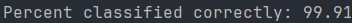

# Single Layer Perceptron Classifier
A single layer perceptron implemented from scratch in Java that classifies handwritten 0s and 1s from the [MNIST in CSV](https://www.kaggle.com/datasets/oddrationale/mnist-in-csv) dataset.
## Results
After training on the 0s and 1s of the MNIST in CSV dataset, the perceptron correctly classified 99.91% of the testing data.

